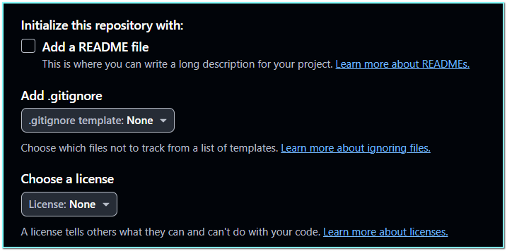
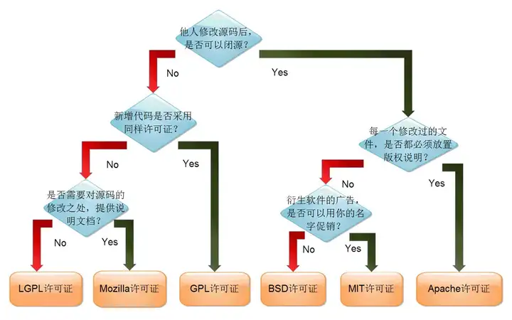
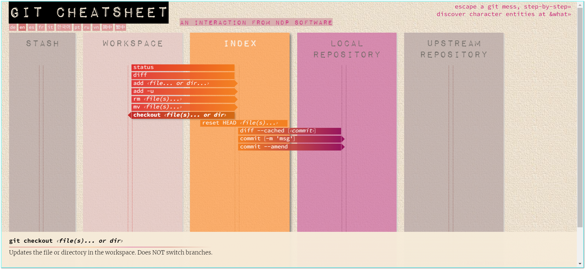

# Hello World

[中文说明](https://github.com/yansheng836/hello-world/blob/master/README.md)  [English](https://github.com/yansheng836/hello-world/blob/master/README-en.md)

这是我的第一个Github仓库，我使用该仓库来熟悉Github的工作流，尝试Github的一些功能。

在学习过程中会记录一些Git/Github的使用技巧。

## 各种语言的Hello World程序

既然是学习，必然少不了hello world。

来源：[24种编程语言的Hello World程序](https://www.runoob.com/w3cnote/hello-world-programs-of-24-programing-language.html)，详见：[HelloWorld-all文件夹](https://github.com/yansheng836/hello-world/blob/master/HelloWorld-all)。

## Github项目常见的文件

### README.md 项目介绍文件

常用于介绍项目，包括项目用途、使用说明、安装手册、开源协议、版权声明等。

用markdown语言编写，一般命名为README.md或者README。

Markdown 官方教程：https://markdown.com.cn/

CSDN编辑器中的介绍（可作为学习语法的参考）：https://github.com/yansheng836/hello-world/blob/master/CSDN-use-md-introduction.md

参考效果：https://github.com/yansheng836/hello-world?tab=readme-ov-file

具体文件：https://github.com/yansheng836/hello-world/blob/master/README.md

---

每个文件夹的README.md文件，当在Github中访问对应的目录时，会直接展示，

如：

- 该项目中的根目录的README.md，可以通过 <https://github.com/yansheng836/hello-world> 直接访问；
- 该项目中的docs目录的README.md，可以通过 <https://github.com/yansheng836/hello-world/tree/master/docs> 直接访问。

---

在Github中创建新项目时可以选择是否为项目自动生成一个README.md文件，相关介绍详见文档：

- 英文版：<https://docs.github.com/en/repositories/managing-your-repositorys-settings-and-features/customizing-your-repository/about-readmes>
- 中文版：<https://docs.github.com/zh/repositories/managing-your-repositorys-settings-and-features/customizing-your-repository/about-readmes>



### .gitignore git忽略文件

该文件是属于git系统的配置文件，用于忽略一些生成的或者是冗余的、不关心的文件，比如：Mac系统中的.DS_Store、C语言项目生成的exe、obj、dll文件等文件。

.gitignore是存文本文件，其中#用于注释。使用git时，可以通过命令：`git status --ignored` 查看到忽略的文件。

具体文件：https://github.com/yansheng836/hello-world/blob/master/.gitignore

---

在Github中创建新项目时可以选择是否为项目自动生成一个.gitignore文件，选择项目所属语言后，会生成一个该语言常用的忽略模板配置文件，具体语言的忽略模板详见：<https://github.com/github/gitignore>，相关介绍详见文档：

- 英文版：<https://docs.github.com/en/get-started/getting-started-with-git/ignoring-files>
- 中文版：<https://docs.github.com/zh/get-started/getting-started-with-git/ignoring-files>


### LICENSE.txt 开源许可证文件

开源许可，表明项目以何种许可进行开源。

一般命名为LICENSE、LICENSE.txt 、LICENSE.md、LICENSE.rst。

参考效果：https://github.com/yansheng836/hello-world?tab=MIT-1-ov-file#readme

具体文件：https://github.com/yansheng836/hello-world/blob/master/LICENSE

常见开源许可证选择图，参考文章：[可供选择的软件开源协议的罗列](https://zhuanlan.zhihu.com/p/519929236)



---

在Github中创建新项目时可以选择是否为项目自动生成一个LICENSE文件，选择项目所属语言后，会生成一个改语言常用的忽略模板配置文件，具体语言的忽略模板详见：<https://github.com/github/gitignore>，相关介绍详见文档：

- 英文版：<https://docs.github.com/en/repositories/managing-your-repositorys-settings-and-features/customizing-your-repository/licensing-a-repository>
- 中文版：<https://docs.github.com/zh/repositories/managing-your-repositorys-settings-and-features/customizing-your-repository/licensing-a-repository>


#### 扩展：CLA 贡献者许可协议

CLA，即：Contributor License Agreement 贡献者许可协议。除了开源协议的约束，一些大公司的项目，为了避免各种纠纷会有一些内容的协议，你需要认可并签署对应的协议才能参与项目的贡献。

可参考阿里巴巴的p3c项目的这个pr的内容：<https://github.com/alibaba/p3c/pull/975>，对应协议内容：<https://cla-assistant.io/alibaba/p3c?pullRequest=975>。

### .gitattributes Github纠正项目语言显示

自动统计语言，将最多的语言作为该项目的语言（即个人仓库列表中显示的语言），这是github的一个特点，gitee就没有。

- 该仓库的语言识别（2019年9月6日）：
  项目主页：
  仓库列表显示：

- Bootstrap仓库的语言识别：
  

如果你的github仓库的语言统计（显示/识别）有问题，例如你项目使用的主要的语言是HTML，但是因为你使用了[Bootstrap](https://github.com/twbs/bootstrap)框架（非CDN方式），默认情况下，github可能会识别到你的仓库中的JavaScript代码比较多，因此会将你的项目识别成一种不是你想要的语言(JavaScript)，那有没有办法进行”自定义“呢？github会告诉你：有！你可以通过`.gitattributes`文件强制github将项目语言识别成你想要的语言，具体介绍可参考：[github/linguist项目](https://github.com/github/linguist)，下面只是简单介绍。


> 需要注意的问题：

- 这些规则仅仅是为了github显示你想要的“项目语言显示棒”，但是不改变语言的属性。这样说你可能不太明白，就拿上面的例子来说：当你设置好`.gitattributes`文件对应的属性时，项目会显示为HTML，但是你点开语言前面的小点，会进到项目语言统计列表中，这里仍然会显示项目使用的各种文件，比如Bootstrap框架的CSS/JS文件。
- 这里只是说`.gitattributes`文件有这个功能，但是该文件的作用却远不止于此，详见：[git 官方 gitattributes文档(English)](https://git-scm.com/docs/gitattributes).


主要有5种类型的属性可以设置，github会读取你设置的属性值，然后有选择的识别某语言的显示。需要注意的是，关于语言的识别github是有一套默认的机制的，例如它会将一些有特征的文档文件（详见：[documentation.yml](https://github.com/github/linguist/blob/master/lib/linguist/documentation.yml)）识别为文档，不统计这种语言。更多默认设置可参考：<https://github.com/github/linguist/blob/master/lib/linguist/vendor.yml>。


因此如果你需要自定义，github的建议是`Override`，即重写(或者说是覆盖)默认的设置。


注：下表非官方文档，仅供参考。

| .gitattributes属性分类   | 分类         | 简单说明                                                     | 举例                                    |                                                              |
| ------------------------ | ------------ | ------------------------------------------------------------ | --------------------------------------- | ------------------------------------------------------------ |
| `linguist-language`      | 语言转化     | 将一种语言识别为另一种语言                                   | `*.rb linguist-language=Java`           | [`languages.yml`](https://github.com/github/linguist/blob/master/lib/linguist/languages.yml) |
| `linguist-vendored`      | 供应(商)代码 | 标记供应商文件，把使用的库文件标记为供应商代码（即不是自己编写的），如jQuery库文件 | `jquery.js linguist-vendored`           | [`vendor.yml`](https://github.com/github/linguist/blob/master/lib/linguist/vendor.yml) |
| `linguist-generated`     | 生成的代码   | 标记一些生成的文件，如压缩的js默认被忽略                     | Api.elm linguist-generated=true         | [`generated.rb`](https://github.com/github/linguist/blob/master/lib/linguist/generated.rb) |
| `linguist-documentation` | 文档         | 标记一些文档                                                 | `project-docs/* linguist-documentation` | [`documentation.yml`](https://github.com/github/linguist/blob/master/lib/linguist/documentation.yml) |
| `linguist-detectable`    | 可检测的     | 标记某文件是否检测为语言，默认（各种常见语言）都可检测，为false时，不进行语言检测 | export_bom.py linguist-detectable=false | [`languages.yml`](https://github.com/github/linguist/blob/master/lib/linguist/languages.yml) |

> 注意：

1. 等号前后是不能有空格的！如果文件`.gitattributes`文件有错误，git add 或者git commit 时会给出提示，github上面也会有相应提示。
2. 对于  `jquery.js linguist-vendored=true`这种属性值为布尔值的，好像只有使用 `jquery.js linguist-vendored`这种形式才有用。


举例：<https://github.com/github/linguist/issues/4590>

>1. Create a file named `.gitattributes` in the root of your project
>
>2. Add the following lines to the `.gitattributes` file:
>
>  ```
>  /BibliotecaGames.Entities/* linguist-vendored=true
>  /BibliotecaGames.BLL/* linguist-vendored=true
>  ```
>
>3. Modify a file in your project to force GitHub to detect the new `.gitattributes` file


github技巧推荐：

- <https://www.cnblogs.com/iamzhanglei/p/6177961.html>

### code-of-conduct.md 贡献者公约(行为准则)

如果你想要参与项目的贡献，就需要遵守项目所有者设置的一些约定，用于维护社区的和谐、稳定发展。（就比如你入职了某个公司，就需要遵守公司的各种规章制度。）

参考效果：https://github.com/yansheng836/hello-world?tab=coc-ov-file

具体文件：https://github.com/yansheng836/hello-world/blob/master/code-of-conduct.md

 [Contributor Covenant](https://www.contributor-covenant.org/) 2.1 版：

- 英文版：https://www.contributor-covenant.org/version/2/1/code_of_conduct/
- 中文版：https://www.contributor-covenant.org/zh-cn/version/2/1/code_of_conduct/

## Git工具

### Git官网

https://git-scm.com/

#### Git文档

文档：https://git-scm.com/docs

github-git-cheat-sheet：

- 英文版：https://training.github.com/downloads/github-git-cheat-sheet/
- 中文版：https://training.github.com/downloads/zh_CN/github-git-cheat-sheet/

git-cheatsheet 可视化Git教程（交互式备忘单，可视化git：<https://github.com/ndp/git-cheatsheet>）：

- 英文版：<http://ndpsoftware.com/git-cheatsheet.html#loc=index;>



#### Pro Git book 英文版

一本比较好的学习Git的书籍。

https://git-scm.com/book/en/v2

#### Pro Git book 中文版

https://git-scm.com/book/zh/v2

### Git删除大文件 git-filter-repo工具

使用场景：一开始因为没有添加gitignore文件忽略一些文件，导致git添加了一个很大的备份文件；发现时，用gitignore进行了忽略，但是这个忽略规则只对后续的文件生效；于是删除了仓库中的旧的备份文件，但是发现仓库大小仍没有变化，因为它并没有删除历史仓库中的该备份文件。虽然使用git也能将历史文件进行删除，但是操作比较繁琐，因此该工具粉墨登场！

git-filter-repo：Quickly rewrite git repository history (filter-branch replacement)：<https://github.com/newren/git-filter-repo/>

---

参考文章：

Git如何清理大文件：<https://www.cnblogs.com/anhiao/p/16964976.html>

git-filter-repo：<https://help.aliyun.com/document_detail/206833.html>

用 git filter-repo 彻底删除Git中的大文件：<https://www.jianshu.com/p/03bf1bc1b543>

Git如何删除历史记录中的大文件详解：<https://www.zhangshengrong.com/p/281ompjDNw/>

git 仓库中删除历史大文件：<https://www.cnblogs.com/bigmango/p/11361344.html>

## Github工具

### Github pages

GitHub Pages旨在从GitHub存储库中托管您的个人，组织或项目页面。

（网上有很多教程利用这个功能搭建个人博客网站，访问地址为：<https://user.github.io/repo/>。）

将Github项目中的文档发布成网站，可指定对应分支、目录、主题等。

配置文档：

- 英文版：https://docs.github.com/en/pages/getting-started-with-github-pages/configuring-a-publishing-source-for-your-github-pages-site

- 中文版：https://docs.github.com/zh/pages/getting-started-with-github-pages/configuring-a-publishing-source-for-your-github-pages-site

---

2019年7月22日11:07:27 添加：[https://yansheng836.github.io/hello-world/](https://yansheng836.github.io/hello-world/)

### docsify

> 一个神奇的文档网站生成器。

<https://docsify.js.org/#/zh-cn/>

## Code of Conduct

[](code-of-conduct.md)

如果你想要参与贡献必要准遵守我们的 [行为准则](code-of-conduct.md) ；如果你发现有人违反该准则，可以通过 [我的邮箱](yansheng0063@163.com) 联系我。

## Contributing

Our goal is for this project to reflect community best practices, so we'd love your input! Got a question or an idea? Check out our [contributing guidelines](CONTRIBUTING.md) for ways to offer feedback and contribute.

## License

<div style="text-align:left"></div>

This software is licensed under the MIT License. [View the license](https://github.com/yansheng836/hello-world/blob/master/LICENSE).


